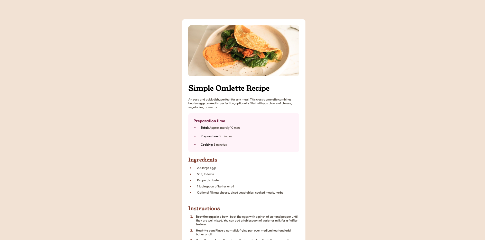

# Frontend Mentor - Recipe page solution

This is a solution to the [Recipe page challenge on Frontend Mentor](https://www.frontendmentor.io/challenges/recipe-page-KiTsR8QQKm). Frontend Mentor challenges help you improve your coding skills by building realistic projects. 

## Table of contents

- [Overview](#overview)
  - [The challenge](#the-challenge)
  - [Screenshot](#screenshot)
  - [Links](#links)
- [My process](#my-process)
  - [Built with](#built-with)
  - [What I learned](#what-i-learned)
  - [Continued development](#continued-development)
- [Author](#author)

## Overview

### Screenshot

### Links

- Solution URL: [Github Solution](https://github.com/dilaraj/recipe-page-main)
- Live Site URL: [Live Solution](https://dilaraj.github.io/recipe-page-main/)

## My process

### Built with

- CSS custom properties
- Flexbox
- CSS Grid
- CSS Media Query
- Web-first workflow
- [React](https://reactjs.org/) - JS library
- Github pages

### What I learned

The main thing that I learnt in this project is the media query in css which allowed for mobile compatibility for the website

### Continued development
I would like to continue working on my skills of making websites compatible with mobile search browser such as working on media queries

## Author

- Website - Not available yet
- Frontend Mentor - [@dilaraj](https://www.frontendmentor.io/profile/dilaraj)
- LeetCode - [@dilaraj](https://leetcode.com/u/dilaraj/)
- GitHub - [@dilaraj](https://github.com/dilaraj)